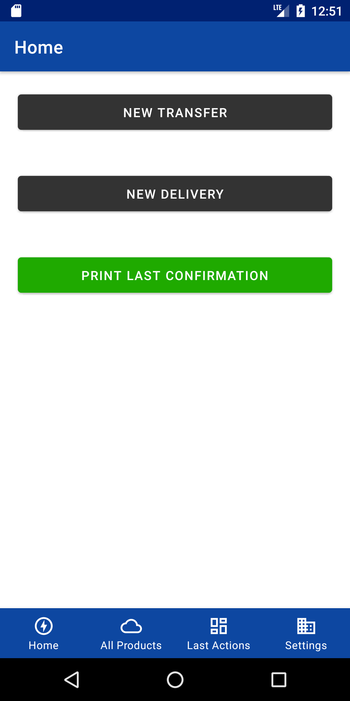
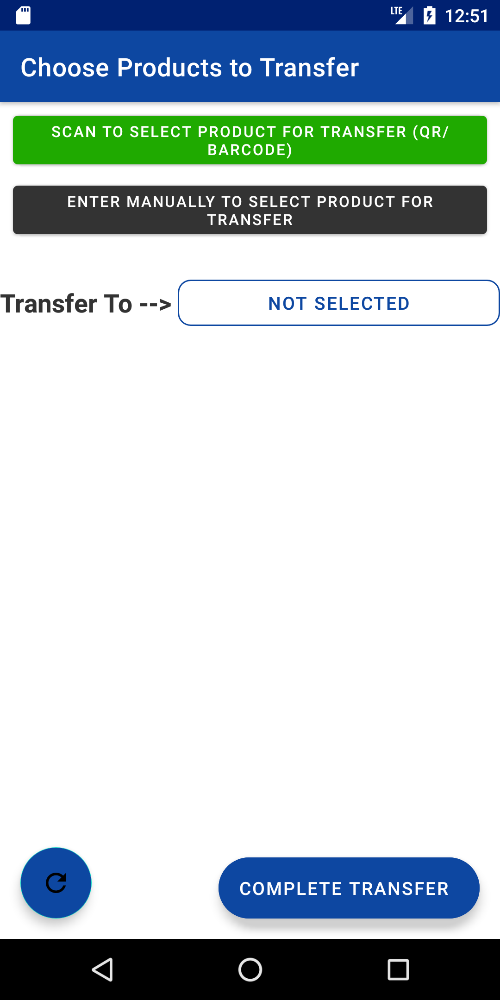
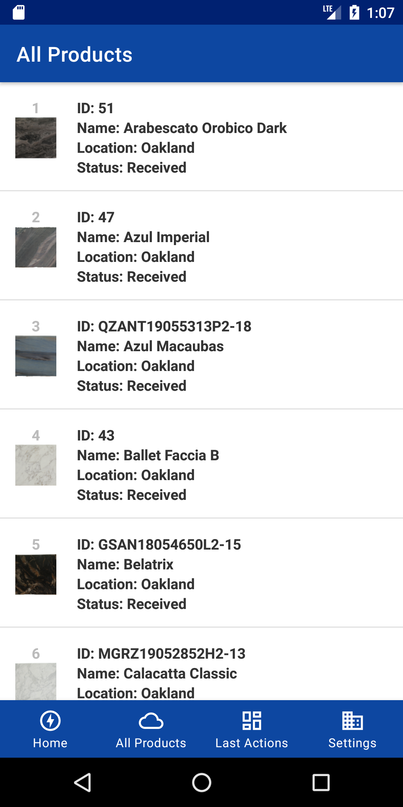
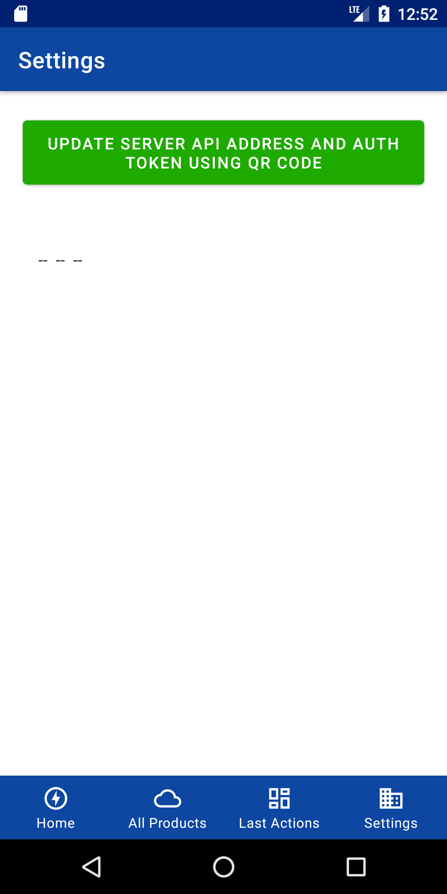

# InventoryPortal
[Android-Java] Warehouse Inventory Mobile App that interacts with Custom API to create transfers between warehouses, deliveries, product info updates, and more. It uses Barcode and QR-Code to detect products.
 

